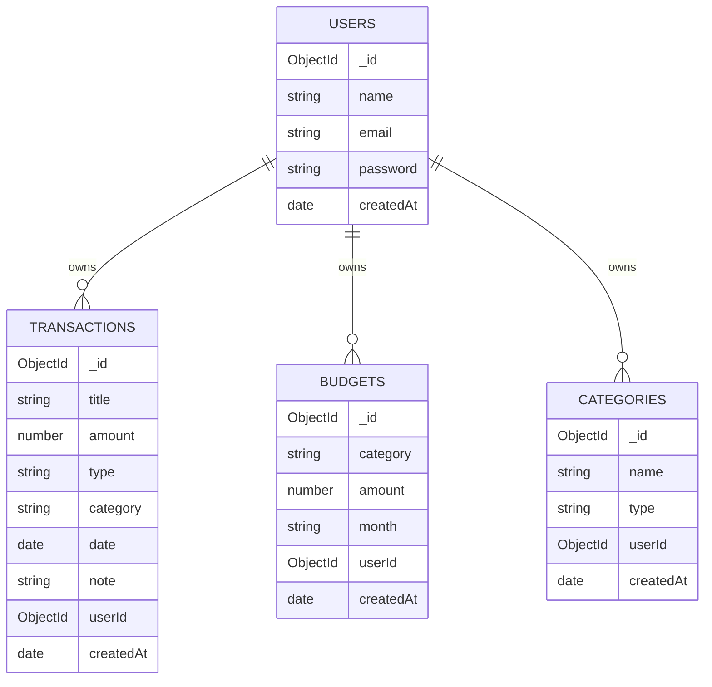

# FinanceFlow

FinanceFlow is a full-stack personal finance and budget tracking application. Users can register, log in, manage income and expense transactions, create categories, set monthly budgets, and view dashboard charts for spending habits.

## Tech Stack

- Frontend: React, Vite, Tailwind CSS, React Router DOM, Axios, Recharts, React Icons
- Backend: Node.js, Express.js, MongoDB, Mongoose, JWT, bcryptjs
- Deployment targets: Vercel for frontend, Render for backend, MongoDB Atlas for database

## Features

- JWT authentication with password hashing
- Protected REST API routes
- Transactions CRUD with category, type, and date filters
- Income and expense categories CRUD
- Monthly budgets CRUD with exceeded-budget warnings
- Dashboard summary cards for income, expenses, balance, and budget usage
- Recharts visualizations for expense distribution, income vs expense, and budget progress
- Responsive light theme UI with sidebar navigation

## Project Structure

```text
Finance_tracker_App/
├── backend/
│   ├── config/
│   ├── controllers/
│   ├── middleware/
│   ├── models/
│   ├── routes/
│   ├── utils/
│   └── server.js
└── frontend/
    └── src/
        ├── api/
        ├── charts/
        ├── components/
        ├── context/
        ├── pages/
        ├── routes/
        └── utils/
```

## ER Diagram



## Backend Setup

```bash
cd backend
npm install
```

Create `backend/.env`:

```env
PORT=5000
MONGO_URI=your_mongodb_atlas_connection_string
JWT_SECRET=replace_with_a_long_random_secret
CLIENT_URL=http://localhost:5173
```

Run the backend:

```bash
npm run dev
```

Backend API runs at `http://localhost:5000`.

## Frontend Setup

```bash
cd frontend
npm install
```

Create `frontend/.env`:

```env
VITE_API_URL=http://localhost:5000/api
```

Run the frontend:

```bash
npm run dev
```

Frontend runs at `http://localhost:5173`.

## API Endpoints

Authentication:

- `POST /api/auth/register`
- `POST /api/auth/login`

Transactions:

- `GET /api/transactions`
- `POST /api/transactions`
- `PUT /api/transactions/:id`
- `DELETE /api/transactions/:id`

Budgets:

- `GET /api/budgets`
- `POST /api/budgets`
- `PUT /api/budgets/:id`
- `DELETE /api/budgets/:id`

Categories:

- `GET /api/categories`
- `POST /api/categories`
- `PUT /api/categories/:id`
- `DELETE /api/categories/:id`

Protected endpoints require an Authorization header:

```text
Authorization: Bearer <jwt_token>
```

## Deployment Notes

Frontend on Vercel:

- Build command: `npm run build`
- Output directory: `dist`
- Environment variable: `VITE_API_URL=https://your-render-api.onrender.com/api`

Backend on Render:

- Root directory: `backend`
- Build command: `npm install`
- Start command: `npm start`
- Environment variables: `MONGO_URI`, `JWT_SECRET`, `CLIENT_URL`

Database on MongoDB Atlas:

- Create a cluster
- Create a database user
- Allow network access
- Copy the connection string into `MONGO_URI`

## Assignment Deliverables

- GitHub repository with this source code
- README setup instructions
- ER diagram included above
- Deployment links after publishing frontend and backend
- Technical presentation covering architecture, auth flow, CRUD APIs, and charts
- Demo video showing register/login, CRUD flows, dashboard charts, and budget warnings
